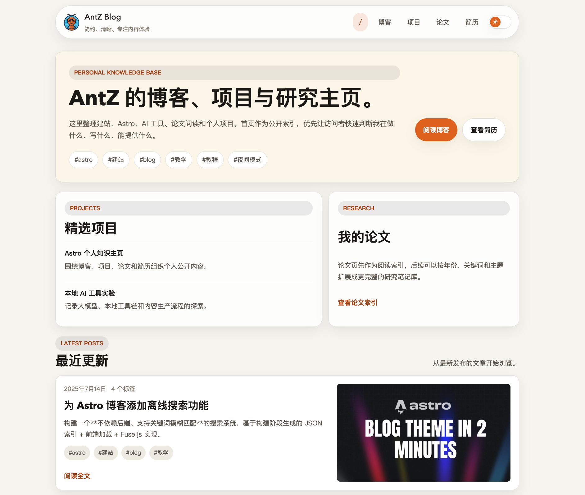
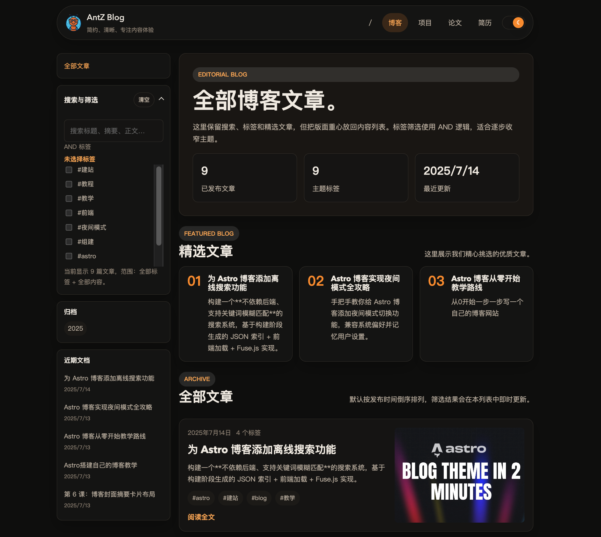

# AntZ Blog Template

[English](../README.md) | [简体中文]()

## 预览

| Light                             | Dark                             |
| -------------------------------- | --------------------------------- |
|  |  |
|  |  |

一个面向个人博客/知识库的 Astro 模板，强调内容优先、阅读体验和可维护性。

- MD/MDX 内容工作流
- 标签筛选 + 全文搜索
- 文章目录（TOC）
- 响应式布局 + 亮/暗主题
- 开箱可部署到 Cloudflare Pages

## 演示

- 线上示例：[https://antz.top](https://antz.top)

## 快速开始

```bash
npm install
npm run dev
```

访问 `http://localhost:4321`。

常用命令：

- `npm run dev`：本地开发
- `npm run build`：生产构建到 `dist/`
- `npm run preview`：本地预览构建结果
- `npm run check`：执行 Astro 检查

## 内容写作

博客文章目录：`src/content/blog/`

每篇文章使用 `.md` 或 `.mdx`，Frontmatter 示例：

```yaml
---
title: "文章标题"
description: "一句话摘要"
pubDate: 2026-05-21
tags: ["Astro", "Blog"]
cover: "/cover/your-image.jpg"
---
```

必填字段：`title`、`description`、`pubDate`。

## 模板自定义

常见改动点：

- 布局与导航：`src/layouts/Layout.astro`
- 首页内容：`src/pages/index.astro`
- 联系方式：`src/components/ContactLinks.astro`
- 全局主题变量与样式：`src/styles/global.css`

## Cloudflare Pages 部署

1. 将仓库推送到 GitHub。
2. 在 Cloudflare Pages 连接该仓库。
3. 构建配置：
- Framework preset: `Astro`
- Build command: `npm run build`
- Build output directory: `dist`
4. 在 Pages 添加环境变量：
- `SITE_URL=https://你的域名`
5. 部署并绑定自定义域名。

## 发布前检查

```bash
npm run check
npm run build
```

确认：

- 首页、博客列表、文章详情页可正常访问
- 标签筛选和搜索正常
- 移动端和桌面端样式正常

## 推广建议

### 1) Astro 生态

- 提交 Astro Showcase：`https://astro.build/showcase/`
- 后续若抽象成通用主题，可提交 Astro Themes：`https://astro.build/themes/`

### 2) 搜索引擎收录

- 上线后将 `public/robots.txt` 里的 sitemap 改为真实域名
- 在 Google Search Console 提交 sitemap
- 保持文章标题、摘要、标签清晰一致

### 3) 社区分发

首月节奏建议：

- 第 1 周：发布开源介绍（X / 掘金 / 社区）
- 第 2 周：发布技术拆解（DEV.to / Reddit `r/astro`、`r/webdev`）
- 第 3-4 周：根据反馈迭代并发布更新

### 4) 数据追踪

- 为不同渠道添加 UTM 参数
- 跟踪指标：UV、阅读时长、GitHub star/fork、部署反馈

## License

MIT
